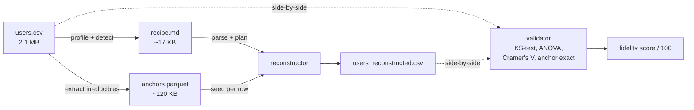
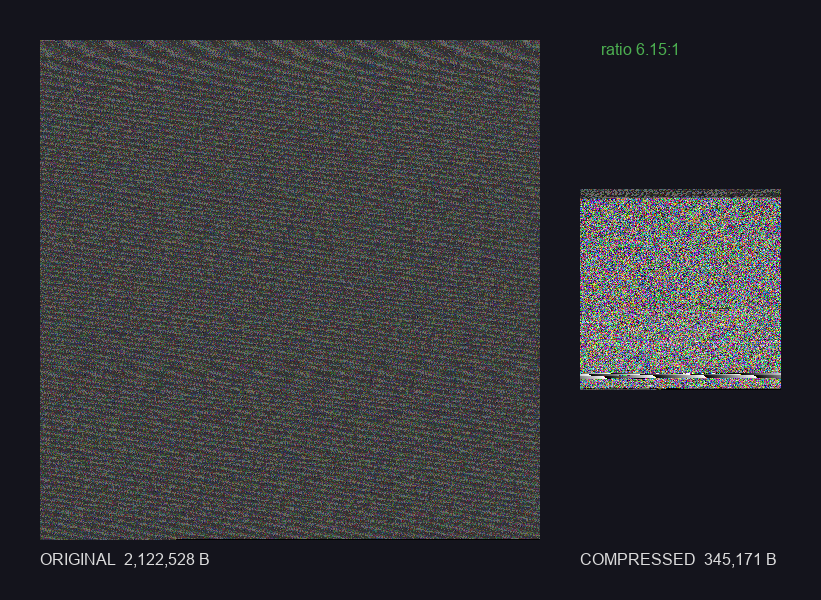

# Semantic Compressor

> Store the **recipe** of a database, not its rows. Re-bake the data at decompress time.


*Visual fingerprint of `users.csv` (10 000 rows) after compression: irreducible anchor bytes look like noise, while the recipe markdown forms regular stripes at the bottom.*

---

## What is this?

A proof of concept for **semantic database compression**. Instead of storing
the raw rows of a table, the compressor extracts:

1. **A recipe** (`output/recipes/<table>.md`) — a human-readable markdown file
   that describes how to regenerate the table: schema, distributions,
   correlations, functional dependencies, generation rules.
2. **Anchors** (`output/anchors/<table>_anchors.parquet`) — only the
   irreducible values (unique IDs, emails, password hashes) that cannot be
   inferred from statistics.
3. **A reconstructor** — rebuilds the original CSV from recipe + anchors, with
   `sha256`-derived seeding per row so two reconstructions are bit-for-bit
   identical.

**Analogy.** It is like storing the *recipe* for a cake (one page of text)
instead of an HD photo of every slice. With the recipe plus a pinch of
specific ingredient (the anchors), you re-bake a near-identical cake.

This POC validates that the **mechanics** of recipe / anchor / reconstruct
work end-to-end, on a synthetic 10k-row dataset, with deterministic Python
only (no LLM, no neural network).

## Quick start

```powershell
# Windows / PowerShell
cd D:\semantic-compressor
python -m venv .venv
.venv\Scripts\Activate.ps1
pip install -r requirements.txt

# Generate the 10k synthetic users dataset
python examples\generate_fake_db.py

# Run the full POC end-to-end (compress + decompress + validate + report)
python examples\run_poc.py --random-format password_hash --aggressive-uuid
```

```bash
# macOS / Linux
cd semantic-compressor
python -m venv .venv
source .venv/bin/activate
pip install -r requirements.txt

python examples/generate_fake_db.py
python examples/run_poc.py --random-format password_hash --aggressive-uuid
```

## Results

End-to-end run on `data/original/users.csv` (10 000 synthetic users, 2 122 528 B
on disk).

| Metric            | Default mode | `--aggressive-uuid` mode |
|-------------------|--------------|--------------------------|
| Compression ratio | **6.24 : 1** | **15.89 : 1**            |
| Fidelity score    | 100 / 100    | 100 / 100                |
| Wall time         | ~3 s         | ~3 s                     |
| Recipe size       | ~17 KB       | ~17 KB                   |
| Anchor parquet    | ~324 KB      | ~117 KB                  |
| Tests             | 80 / 80 passing | 80 / 80 passing       |

The difference between the two modes is whether UUID-shaped columns named like
`*_id` are stored verbatim (default, lossless) or regenerated from a regex
spec (`--aggressive-uuid`, lossy on the exact value but format-preserving).

Decomposition of the compressed payload (default mode):

```
Original (CSV)              2 122 528 B   (100%)
+--- recipe.md                 16 589 B   ( 0.8% of original,   5% of compressed)
+--- anchors.parquet          323 706 B   (15.3% of original,  95% of compressed)
                            -----------
Total compressed              340 295 B   (16.0% of original  ->  ratio 6.24:1)
```

## How it works



Module by module:

- `src/profiler.py` — per-column statistics: type, distribution, cardinality,
  null rate, regex sniffing on strings.
- `src/pattern_detector.py` — distributions (normal / exponential / uniform /
  power law), correlations (Pearson / Cramer's V / ANOVA), functional
  dependencies, conditional distributions, `RANDOM_FORMAT`, `EMAIL_SPLIT`.
- `src/anchor_extractor.py` — separates irreducible columns (UUIDs, emails)
  from regeneratable ones; writes them to a zstd-22 parquet.
- `src/recipe_writer.py` — serializes the `Recipe` Pydantic model to a
  human-readable, parser-friendly markdown file.
- `src/reconstructor.py` — parses the recipe back, then rebuilds each column
  in topological order (anchors first, derived columns last), seeded by
  `sha256(anchor_id)`.
- `src/validator.py` — runs structural tests (row count, schema, anchors
  exact) and statistical tests (KS-test, mean/std deltas, correlations,
  category frequencies). Outputs a `ValidationReport` with a 0-100 score.
- `src/orchestrator.py` — pipeline glue and the `compress / decompress /
  validate / run-poc` CLI.

## Visual fingerprint

`examples/render_fingerprint.py` encodes the recipe + anchor bytes as pixels.
Same compressed dataset, same fingerprint, bit-for-bit.


The base-4 "DNA" encoding makes the structure visible: the **noisy region at
the top** is the anchor parquet (high entropy — zstd-compressed UUIDs and
emails, near maximum density), the **regular stripes at the bottom** are the
recipe markdown (low entropy — repeating headers, keys, separators).

Side-by-side, original CSV vs compressed payload:



## Features

- Distribution detection: normal, exponential, uniform, power law (scipy fitting)
- Correlation detection: Pearson (num-num), Cramer's V (cat-cat), ANOVA (num-cat)
- Functional dependency detection (e.g. `country_code -> country_name`)
- Conditional distributions: bucket-based per pivot, both numerical and categorical pivots
- `RANDOM_FORMAT` pattern for high-entropy regeneratable columns (password hashes)
- `EMAIL_SPLIT` for lossless email compression via domain dictionary coding
- Strictly reproducible reconstruction (`sha256(anchor_id)` seed per row)
- CLI with four subcommands: `compress`, `decompress`, `validate`, `run-poc`
- Optional HTML profiling report via `ydata-profiling`
- Visual fingerprints: DNA (base-4) and RGB (3 bytes/pixel) encodings
- 80 pytest unit and integration tests, all passing

## Tested on

| Dataset       | Rows   | Size on disk | Default ratio | Aggressive ratio | Fidelity   |
|---------------|--------|--------------|---------------|------------------|------------|
| `users.csv`   | 10 000 | 2.1 MB       | 6.24 : 1      | **15.89 : 1**    | 100 / 100  |
| `orders.csv`  | 10 000 | 1.6 MB       | 3.52 : 1      | (not measured)   | 66.7 / 100 |

`users.csv` is the primary fixture the POC was tuned against (clean
distributions, one categorical pivot). `orders.csv` is a deliberately
different profile (log-normal quantities, conditional NULLs, functional
dependency, two UUID anchors). The current pattern library captures 6 of its
10 columns cleanly; the remaining 4 expose the limits of the V1 detector and
are documented in [`docs/SECOND_DATASET.md`](docs/SECOND_DATASET.md).

## Usage

End-to-end pipeline:

```bash
python examples/run_poc.py \
  --input data/original/users.csv \
  --random-format password_hash \
  --aggressive-uuid
```

Individual CLI subcommands:

```bash
# Compress: CSV -> recipe.md + anchors.parquet
python -m src.orchestrator compress \
  --input data/original/users.csv \
  --output output/ \
  --random-format password_hash \
  --aggressive-uuid

# Decompress: recipe + anchors -> CSV
python -m src.orchestrator decompress \
  --recipe output/recipes/users.md \
  --output data/reconstructed/users.csv

# Validate: compare original vs reconstructed
python -m src.orchestrator validate \
  --original data/original/users.csv \
  --reconstructed data/reconstructed/users.csv
```

Generate the HTML profiling report alongside compression:

```bash
python -m src.orchestrator compress \
  --input data/original/users.csv \
  --output output/ \
  --generate-html-profile
# -> output/profiling_reports/users.html
```

Render the visual fingerprint of a compressed dataset:

```bash
python examples/render_fingerprint.py
# -> output/fingerprints/fingerprint_{dna,rgb,comparison}.png
```

Run the test suite:

```bash
pytest
# 80 passed
```

## Limitations and V2 roadmap

The POC validates the architecture; it does not validate generality across
all schema shapes. Items below are out of scope for V1.

- **LLM-based semantic pattern detection.** Currently 100% deterministic.
  Free-text columns are stored as anchors. A V2 could use an LLM to identify
  templated text (addresses, product names) and emit a generation rule.
- **Relational tables and foreign keys.** Each table is compressed
  independently. A V2 would coordinate joint compression and FK preservation
  across `customer.id` <-> `order.customer_id`.
- **Additional pattern types.** `log-normal` (currently approximated by
  exponential), `OFFSET_FROM_COLUMN` (e.g. `shipped_at = ordered_at + delta`),
  `CONDITIONAL_NULL` (NULL when pivot in set).
- **Conditional distributions on a numerical pivot.** Currently detected only
  for categorical pivots; numerical-on-numerical correlations are logged but
  not promoted to a generation rule.
- **Incremental compression.** Add or update rows without recompressing the
  whole table.
- **Binary recipe format.** The `.md` is optimized for legibility; a packed
  binary form would shave a few percent more.

## Tech stack

Python 3.11+ - pandas - numpy - scipy - DuckDB - Pydantic v2 - ydata-profiling -
Faker - Rich - pytest - pyarrow (zstd)

## See also

- [docs/SPEC.md](docs/SPEC.md) — original specification (the *what*)
- [docs/IMPLEMENTATION_NOTES.md](docs/IMPLEMENTATION_NOTES.md) — design
  decisions and risks (the *how* and *why*)
- [docs/ARCHITECTURE.md](docs/ARCHITECTURE.md) — module-level architecture
  and data flow
- [docs/SECOND_DATASET.md](docs/SECOND_DATASET.md) — generality test on a
  second fixture (`orders.csv`), what the detector caught and what it missed

## License

MIT — see [LICENSE](LICENSE).
