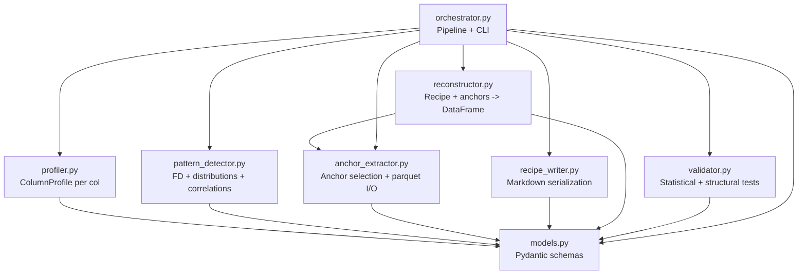
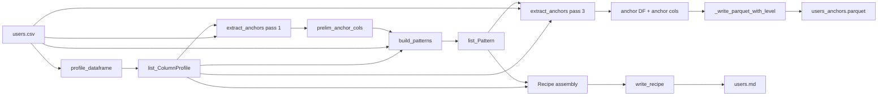
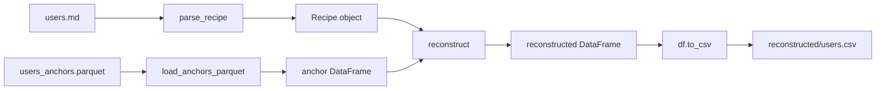
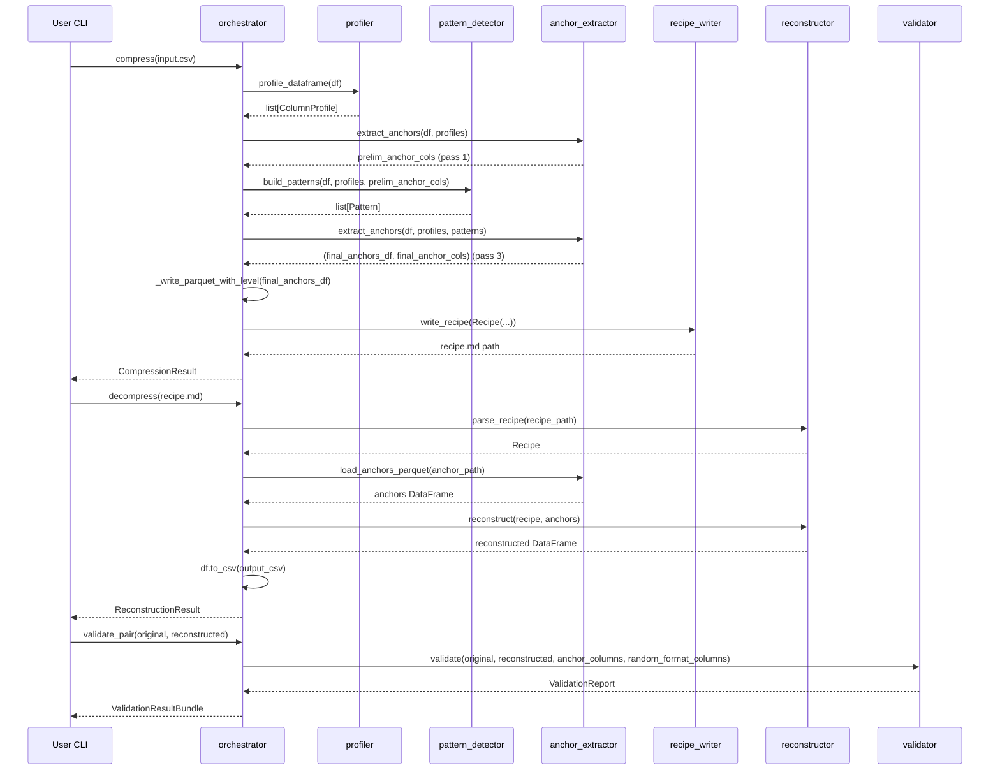
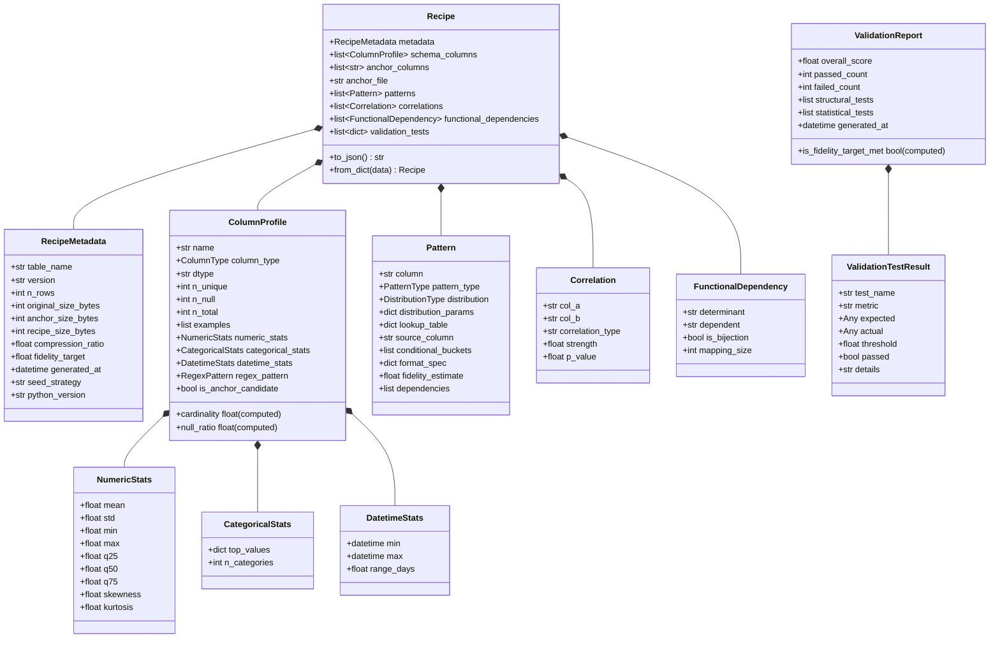

# Architecture

> Reference visuelle des modules, du data flow, et des classes du POC.

## Vue d'ensemble

Le `semantic-compressor` compresse une base de donnees tabulaire (CSV) en deux artefacts complementaires : une **recette** Markdown lisible par l'humain (`output/recipes/<table>.md`) qui decrit comment regenerer chaque colonne, et un **parquet d'ancres** (`output/anchors/<table>_anchors.parquet`) qui ne contient que l'irreductible (IDs uniques, local-parts d'email, indices de domaines).

La philosophie : **stocker la recette + les ancres irreductibles**, pas les donnees brutes. Les colonnes deductibles d'une autre (`country_name` depuis `country_code`), correlees a une autre (`signup_source` sachant `country`), ou suivant une distribution connue (`age ~ Normal(34, 12)`) sont **regenerees a la decompression** depuis un RNG seede par `sha256(anchor_id)`. Resultat : reconstruction byte-stable inter-process, ratio de compression >= 5:1 sur le dataset users.csv de demo, fidelite statistique >= 95% (KS-test, moyennes, correlations, frequences categorielles).

## Module map

Graphe des 8 modules de `src/` et leurs imports croises. `orchestrator.py` cable les 6 modules de logique metier ; `models.py` est la fondation Pydantic, importee par tous les autres.



Notes :
- `reconstructor.py` importe `anchor_extractor.py` uniquement pour les constantes `EMAIL_SPLIT_LOCAL_SUFFIX` / `EMAIL_SPLIT_DOMAIN_IDX_SUFFIX` et la fonction `load_anchors_parquet` (utilitaire IO).
- `pattern_detector.py` ne depend pas de `profiler.py` au runtime : il consomme une `list[ColumnProfile]` produite en amont, mais le type vient de `models.py`.
- `validator.py` est strictement "compare two DataFrames" : il ignore tout du pipeline de compression, ce qui le rend reutilisable hors POC.

## Data flow : compress

Le pipeline `compress()` (defini dans `orchestrator.py`) execute une **triple passe** anchors-patterns pour resoudre la dependance cyclique entre les deux : detection des ancres heuristiques (cardinalite stricte) -> construction des patterns -> ancres finales (incluant les colonnes "sans pattern").



Detail des passes (cf. `orchestrator.compress`) :
- **Pass 1** : `extract_anchors(df, profiles, patterns=None)` selectionne les ancres par cardinalite stricte (`is_anchor_candidate=True`) et les forcages manuels.
- **Pass 2** : `build_patterns(df, profiles, anchor_columns=prelim_anchor_cols)` produit un `Pattern` par colonne (ANCHOR_DIRECT, FUNCTIONAL_DEP, CONDITIONAL_DISTRIBUTION, DISTRIBUTION, RANDOM_FORMAT, EMAIL_SPLIT). Les detections auto RANDOM_FORMAT et EMAIL_SPLIT ont lieu ici.
- **Pass 3** : `extract_anchors(df, profiles, patterns=patterns)` exclut les colonnes RANDOM_FORMAT (regenerees au runtime), substitue les colonnes EMAIL_SPLIT par leurs deux ancres synthetiques `<col>__local` / `<col>__domain_idx`, et ajoute les colonnes "sans pattern" comme ancres de secours. Si le set d'ancres change vs pass 1, les patterns sont reconstruits.

## Data flow : decompress

Le pipeline `decompress()` lit la recette, parse les sections JSON, charge le parquet d'ancres, puis applique chaque pattern dans l'ordre topologique pour chaque ligne.



Pour chaque ligne d'ancres : (1) derive `seed = int(sha256(str(anchor_id)).hex[:8], 16)`, (2) initialise `rng = np.random.default_rng(seed)`, (3) applique les patterns dans l'ordre topologique (`_topological_order` casse les cycles eventuels en supprimant la 1ere arete fermante), (4) cast final par colonne selon `ColumnProfile.dtype`.

## Sequence diagram : round-trip

Vue d'ensemble d'un run end-to-end (CLI `python -m src.orchestrator run-poc` ou `examples/run_poc.py`) : compress -> decompress -> validate.



## Pydantic class hierarchy

Tous les modeles heritent de `_StrictModel` (Pydantic v2 avec `extra="forbid"` et `validate_assignment=True`). `Recipe` est le modele racine, serialise via `model_dump(mode="json")` dans le fichier `.md`.



## Pattern types

`PatternType` (defini dans `models.py`) couvre 6 strategies de generation. Le choix par colonne se fait dans `pattern_detector.build_patterns` selon une priorite stricte (0a -> 0b -> 1 -> 2 -> 3 -> 4).

| PatternType | Generates from | Used for |
|-------------|----------------|----------|
| `ANCHOR_DIRECT` | parquet column | UUIDs preserves comme PK, unique strings, valeurs forcees ancres manuellement |
| `DISTRIBUTION` | `rng` + `distribution_params` | Colonnes independantes (numeric / categorical / datetime) : `age ~ Normal`, `country ~ CategoricalFreq` |
| `FUNCTIONAL_DEP` | `source_column` + `lookup_table` | A -> B deterministe (`country_code -> country_name`) |
| `CONDITIONAL_DISTRIBUTION` | `source_column` + `conditional_buckets` | Colonnes correlees (`signup_source` sachant `country`, `last_login` sachant `premium`) |
| `RANDOM_FORMAT` | `rng` + `format_spec` (`prefix`/`suffix`/`body_type`/`body_length`/`regex`) | Valeurs regenerables a format fige : bcrypt hash, hex hash, UUID v4 (avec garde-fou id-like) |
| `EMAIL_SPLIT` | `<col>__local` (ancre str) + `<col>__domain_idx` (ancre uint8/16) + `format_spec.domain_dict` | Encodage **lossless** des emails : preserve la valeur exacte ; gain typique ~10 B/ligne via dictionnaire de domaines |

Les `DistributionType` supportes par `DISTRIBUTION` et les buckets de `CONDITIONAL_DISTRIBUTION` : `NORMAL`, `EXPONENTIAL` (avec mode `reversed` pour les distributions decroissantes vers la fin), `UNIFORM`, `POWER_LAW`, `CATEGORICAL_FREQ`, `EMPIRICAL` (fallback : sample dans les 50 premieres valeurs uniques).

## Reconstruction algorithm

Pseudo-code de `reconstructor.reconstruct` : tri topologique + seeding deterministe par ligne + cast final.

```python
def reconstruct(recipe, anchors):
    # 1. Tri topologique des patterns par dependencies (casse les cycles si necessaire).
    ordered_columns = _topological_order(recipe.patterns, schema_col_names)
    pattern_index = {p.column: p for p in recipe.patterns}
    profile_index = {p.name: p for p in recipe.schema_columns}

    # 2. Cache des ancres en list-of-dicts pour eviter le cout iloc[i] par ligne.
    anchor_records = anchors.to_dict(orient="records")
    seed_col = anchors.columns[0]  # 1ere colonne d'ancre = cle de seeding

    for i, anchor_row in enumerate(anchor_records):
        # 3. Seed deterministe : sha256(str(anchor_id))[:8] -> int 32 bits.
        seed = derive_row_seed(anchor_row[seed_col])
        rng = np.random.default_rng(seed)
        row = {}

        for col in ordered_columns:
            pattern = pattern_index[col]
            profile = profile_index[col]

            if pattern.pattern_type == ANCHOR_DIRECT:
                row[col] = anchor_row[col]

            elif pattern.pattern_type == DISTRIBUTION:
                value = _sample_distribution(rng, pattern.distribution, pattern.distribution_params)
                # Conversion datetime (seconds_since_epoch -> ISO) si applicable + clip aux bornes profil.
                row[col] = _cast_to_column_type(value, profile)

            elif pattern.pattern_type == FUNCTIONAL_DEP:
                # Pas de tirage rng : lookup pur.
                row[col] = pattern.lookup_table[row[pattern.source_column]]

            elif pattern.pattern_type == CONDITIONAL_DISTRIBUTION:
                bucket = _find_bucket(pattern.conditional_buckets, row[pattern.source_column])
                row[col] = _sample_from_bucket(rng, bucket)

            elif pattern.pattern_type == RANDOM_FORMAT:
                # Pas d'ancre : on regenere une valeur conforme au format.
                row[col] = generate_random_format_value(rng, pattern.format_spec)

            elif pattern.pattern_type == EMAIL_SPLIT:
                local = anchor_row[f"{col}__local"]
                idx = int(anchor_row[f"{col}__domain_idx"])
                domain = pattern.format_spec["domain_dict"][idx]
                row[col] = f"{local}@{domain}"

        yield row

    # 4. Assemblage avec ordre colonnes = recipe.schema_columns (pas l'ordre topo).
    df = pd.DataFrame(generated_rows, columns=schema_col_names, index=anchor_index)
    # 5. Cast final dtype par colonne (int64/Int64/bool).
    return df
```

Points cles :
- `derive_row_seed` utilise **sha256** explicitement : `hash()` natif Python est randomise inter-process (`PYTHONHASHSEED`), inutilisable pour la reproductibilite.
- L'ordre topologique est calcule a partir de `Pattern.dependencies` ; en cas de cycle (typiquement 2 colonnes correlees reciproquement), `_topological_order` casse iterativement la 1ere arete fermante et log un warning.
- Les valeurs numeriques generees par DISTRIBUTION sont **clipees aux bornes observees** (`profile.numeric_stats.min/max`) pour eviter qu'un Normal(34, 12) produise des ages negatifs.

## Recipe file format

Le fichier `.md` produit par `recipe_writer.write_recipe` suit un contrat strict, parse par `reconstructor.parse_recipe`.

Structure :
- 8 sections markdown niveau 2 dans un ordre fige : `METADATA`, `SCHEMA`, `ANCHORS`, `PATTERNS`, `CORRELATIONS`, `FUNCTIONAL_DEPENDENCIES`, `RECONSTRUCTION_ALGORITHM`, `VALIDATION_TESTS`.
- Chaque section "data" est precedee d'un marker HTML `<!-- DATA -->` immediatement suivi d'un bloc ```` ```json ... ``` ```` (cf. constante `DATA_MARKER` dans `recipe_writer.py`).
- Le payload JSON provient toujours de `model.model_dump(mode="json")` (compatible `json.loads`, encodage UTF-8 strict, newline LF).
- Les patterns sont serialises en **ordre topologique** (dependencies first) via `graphlib.TopologicalSorter`.
- Les `computed_field` (`cardinality`, `null_ratio` de `ColumnProfile`) sont exclus du payload SCHEMA pour garantir le round-trip (`extra="forbid"` empecherait sinon le reload).
- La section `RECONSTRUCTION_ALGORITHM` contient du texte libre (pas de bloc data) ; elle est ignoree par le parser, presente uniquement pour la lisibilite humaine.

Extrait minimal :

```markdown
# RECIPE: users

> Compression of users : 10000 rows, ratio 8.3:1, fidelity target 95%

## METADATA

<!-- DATA -->
```json
{
  "table_name": "users",
  "version": "1.0",
  "n_rows": 10000,
  "compression_ratio": 8.3,
  ...
}
```

## SCHEMA
...

## PATTERNS

<!-- DATA -->
```json
[
  {"column": "id", "pattern_type": "anchor_direct", ...},
  {"column": "country_name", "pattern_type": "functional_dep", "source_column": "country_code", "lookup_table": {...}},
  ...
]
```
...
```

## Cross-references

- Specification : [SPEC.md](SPEC.md)
- Notes d'implementation : [IMPLEMENTATION_NOTES.md](IMPLEMENTATION_NOTES.md)
- Experience second dataset : [SECOND_DATASET.md](SECOND_DATASET.md)
