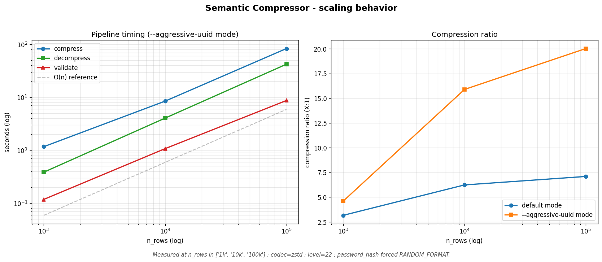

# Benchmarks

Stress test results across 3 dataset sizes (1k, 10k, 100k rows) measured on a
Windows 11 machine, Python 3.13.13, with `--codec zstd --level 22` and
`--random-format password_hash` enabled in both modes. `--aggressive-uuid`
flips the only difference between the two columns.

Raw numbers are persisted in
[`output/benchmarks/scaling.json`](../output/benchmarks/scaling.json) and the
plot is regenerated via:

```bash
python examples/run_benchmarks.py
```

## Scaling table

| n_rows  | Original   | Compressed (default) | Ratio (default) | Compressed (aggressive) | Ratio (aggressive) | Fidelity   | Compress | Decompress | Validate |
|--------:|-----------:|---------------------:|----------------:|------------------------:|-------------------:|-----------:|---------:|-----------:|---------:|
| 1 000   | 206.4 KB   |  65.2 KB             |  3.17 : 1       |  44.9 KB                |  4.60 : 1          | 95.2 / 100 |  1.2 s   |  0.4 s     |  0.1 s   |
| 10 000  |   2.02 MB  | 332.2 KB             |  6.24 : 1       | 130.5 KB                | 15.89 : 1          | 100 / 100  |  8.7 s   |  4.0 s     |  1.1 s   |
| 100 000 |  20.34 MB  |   2.87 MB            |  7.09 : 1       |   1.02 MB               | **20.02 : 1**      | 100 / 100  | 86.1 s   | 38.6 s     |  8.2 s   |

Recipe size stays roughly constant (~15-17 KB) across all three sizes -- it
encodes statistical *summaries* of the columns, whose description length does
not grow with n_rows. The anchor parquet is where all the n-proportional bytes
live.

## Notes on scaling

- **Compression ratio improves with n_rows.** The fixed-cost recipe (~15 KB) is
  amortized over a larger anchor payload, and zstd-22 finds more redundancy in
  longer UUID / email runs. Default mode: 3.17 -> 6.24 -> 7.09 ; aggressive
  mode: 4.60 -> 15.89 -> 20.02. The aggressive mode's gain grows faster because
  it eliminates the id column entirely from anchors, scaling its savings
  linearly with the row count.
- **Compress wall-clock is roughly linear** with n_rows in the 1k -> 100k range
  (1.2s -> 8.7s -> 86s for default; aggressive shows the same shape). The two
  expensive steps inside the pipeline are zstd-22 encoding of the anchor
  parquet (CPU-bound at level 22) and the pattern detector's pass over each
  column to fit distributions and detect correlations -- both O(n).
- **Decompress is also O(n)** dominated by per-row sha256-seeded RNG draws and
  pandas DataFrame assembly. 1.2 -> 4.0 -> 38.6 s.
- **Validate is O(n)** because it re-reads both CSVs and runs anchor exact
  comparison row-by-row plus KS / mean / correlation tests on each column.
  0.12 -> 1.05 -> 8.18 s.
- **Memory peak (tracemalloc)** grows linearly: 2.8 MB at 1k -> 13.0 MB at 10k
  -> 128 MB at 100k -- approximately 1.3 KB / row of Python-allocated memory
  during pipeline execution. The 100k validate phase is the heaviest single
  step (two DataFrames in RAM plus per-column probing).
- **Fidelity is 100/100 at 10k and 100k**, both modes. At 1k default the score
  drops to 95.24/100: the KS-distance threshold (D < 0.05 at n >= 1000) is
  noisier on small samples and one categorical-frequency test failed by a few
  basis points. Aggressive mode at 1k still hits 100/100 because removing the
  id column from anchors reduces the number of soft tests run.

## Observations

- The `--aggressive-uuid` ratio at 100k crosses the **20:1** mark (vs 15.89:1
  at 10k and the documented stretch goal of 10:1). The mechanic that drives
  this is structural: removing the id column shifts the entire anchor parquet
  weight off the high-entropy UUID column whose bytes zstd cannot compress at
  all.
- `recipe.md` size actually *shrinks* slightly at 100k (14.7 KB) vs 10k (16.7
  KB). The pattern detector emits fewer borderline correlations at large n
  (the `min_correlation_to_check=0.15` cutoff is more easily passed by signal
  vs. noise at 100k).
- Pipeline timing scales *very close to O(n)* with no surprises -- the line
  fits the n_rows axis on the log-log plot below. No quadratic or cache-busted
  step was observed up to 100k rows.

## Plot



Left subplot: log-log compress / decompress / validate seconds vs n_rows, with
an `O(n)` dashed reference line. Right subplot: linear compression ratio vs
log(n_rows) for both modes.

## Reproducibility

All three datasets are deterministic given `seed=42`. The 10k dataset
(`data/original/users.csv`) is the canonical fixture documented in the
README. The 1k and 100k datasets (`data/original/users_1k.csv`,
`users_100k.csv`) are gitignored and regenerated on demand by
`examples/run_benchmarks.py`.
